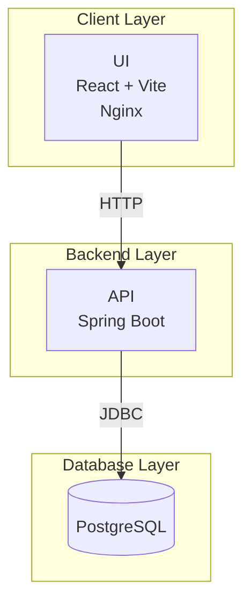

# Personal Finance Management App

This project is a **personal finance management platform** built with a Spring Boot backend (API) and a React + Vite frontend (UI).  
It provides features for managing **users, accounts, transactions, budgets, categories, and recurring transactions**.

The backend uses **PostgreSQL** as the database, with schema initialization handled via SQL migration scripts.  
Authentication and authorization are based on **OAuth2 / JWT**, and observability is enabled with **Spring Boot Actuator**.

---

## 🏗️ Tech Stack

- **Backend (API):** Java 21, Spring Boot 3.5, Spring Security (OAuth2 Resource Server), JPA/Hibernate
- **Frontend (UI):** React 18, Vite, served via Nginx
- **Database:** PostgreSQL 15 (alpine image)
- **Containerization:** Docker & Docker Compose

---

## 📂 Project Structure

```text
project-root/
├── api/                  # Spring Boot API
│   ├── src/
│   └── sql/              # Database init scripts (executed on first container startup)
│
├── personal-finance-ui/  # React + Vite frontend
│   ├── src/
│   └── vite.config.ts
│
├── docker-compose.yml    # Compose setup for DB, API, UI
├── .env                  # Environment variables for local/dev
├── LICENSE               # License file
├── README.md             # You are here
```

---

## 🖼️ Architecture

The application follows a **client-server architecture** with a clear separation of concerns between the frontend, backend, and database. The components are containerized using Docker and orchestrated via Docker Compose.

### Architecture Diagram



**Description:**

- **Client Browser**: Users access the application via a web browser, interacting with the React frontend served by Nginx.
- **Nginx**: Acts as a reverse proxy, serving static frontend assets and routing API requests to the Spring Boot backend.
- **React + Vite Frontend**: Handles the user interface, making REST API calls to the backend for data operations.
- **Spring Boot API**: Manages business logic, authentication (via OAuth2/JWT), and data persistence using JPA/Hibernate.
- **PostgreSQL Database**: Stores all data (users, accounts, transactions, budgets, categories, recurring transactions) with schema initialized via SQL scripts.
- **Identity Provider**: External service for OAuth2-based authentication and JWT issuance.
- **Actuator Endpoints**: Provides monitoring and observability metrics for the backend.

---

## ⚙️ Prerequisites

```text
- Docker (latest version)
- Docker Compose v2+
- Java 21 (only if running API locally without Docker)
- Node.js 20+ (only if running UI locally without Docker)

⚠️ Ports used by default:
- 5432 → PostgreSQL
- 8080 → API
- 3000 → UI (via Nginx)
```

---

## 🔑 Configuration

All project-specific config parameters are supplied via a `.env` file in the project root.

```env
# Database
DATASOURCE_USERNAME=<your-db-user>
DATASOURCE_PASSWORD=<your-db-password>
DATABASE_URL=jdbc:postgresql://postgres:5432/finance_db

# OAuth2 (replace with your IdP details)
OAUTH2_ISSUER_URI=https://your-issuer.example.com
OAUTH2_AUDIENCE=<your-idp-audience>

# API server port
SERVER_PORT=8080
```

---

## 🚀 Running the Project

```bash
# 1. Build and start all services
./run.sh
# or on Windows
run.bat

# 2. Access the services:
UI: http://localhost:3000
API: http://localhost:8080/api/v1
Actuator Health: http://localhost:8080/actuator/health
Swagger UI: http://localhost:8080/swagger-ui.html

# 3. Stop the services
docker-compose down

# Add -v to remove database volumes (⚠️ deletes all data):
docker-compose down -v
```

---

## 🗄️ Database Initialization

```text
On first startup, PostgreSQL runs the script:
  api/sql/00_init.sql

This script creates:
- Required tables (users, accounts, transactions, budgets, categories, recurring_transactions, etc.)
- Necessary extensions (uuid-ossp)
- Indexes for performance

If the database volume already exists, the script will not run again.
```

---

## 📊 Monitoring

```text
Spring Boot Actuator endpoints:
- /actuator/health
- /actuator/info
- /actuator/metrics
```

---

## 🧪 Development Notes

```text
Backend Hot Reload:
  ./gradlew bootRun  (runs Spring Boot API locally)
  OR
  ./docker_run.sh
  ./docker_run.bat (on Windows)
  Keep only DB in Docker

Frontend Hot Reload:
  npm run dev (from personal-finance-ui/)
  Served on http://localhost:5173 with proxy to API
```

---

## ✅ Next Steps

```text
- Add CI/CD pipeline (GitHub Actions / Render / AWS)
- Configure Prometheus + Grafana dashboards
- Extend account creation rules (configurable max accounts per user)
```

---

## 📝 License

See the [LICENSE](./LICENSE) file for details.
