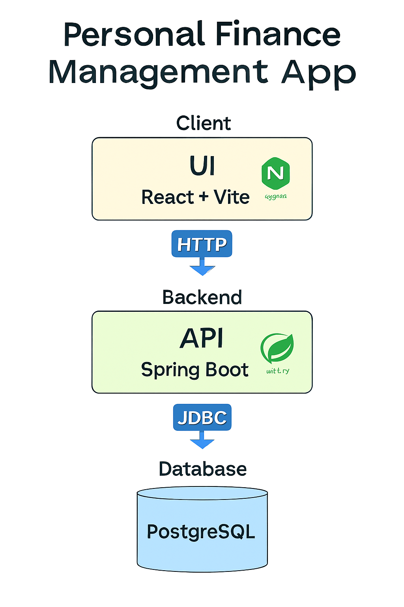

````markdown
# 💰 Personal Finance Management App

A **full‑stack personal finance management platform** with a **Spring Boot** backend (API) and a **React + Vite** frontend (UI).  
It helps you manage **users, accounts, transactions, budgets, categories, and recurring transactions** with secure authentication and modern DevOps practices.

---

## ✨ Features

- **User & Account Management** – Create and manage multiple accounts per user.
- **Transactions** – Track income, expenses, and transfers.
- **Budgets & Categories** – Organize spending and set financial goals.
- **Recurring Transactions** – Automate regular payments or income.
- **Secure Authentication** – OAuth2 / JWT‑based security.
- **Observability** – Spring Boot Actuator endpoints for health and metrics.
- **Containerized Deployment** – Fully Dockerized for easy setup.

---

## 🏗 Tech Stack

| Layer        | Technologies                                                                      |
| ------------ | --------------------------------------------------------------------------------- |
| **Backend**  | Java 21, Spring Boot 3.5, Spring Security (OAuth2 Resource Server), JPA/Hibernate |
| **Frontend** | React 18, Vite, served via Nginx                                                  |
| **Database** | PostgreSQL 15 (alpine)                                                            |
| **DevOps**   | Docker, Docker Compose                                                            |

---

---

## 🖼 Architecture Overview

Below is a high‑level view of how the **UI**, **API**, and **Database** interact in the Personal Finance Management App:



**Flow:**

1. **UI (React + Vite)** served via **Nginx** communicates with the backend over **HTTP**.
2. **API (Spring Boot)** handles business logic, authentication, and data processing.
3. **PostgreSQL** stores all persistent data, accessed by the API via **JDBC**.

---

## 📂 Project Structure

```text
project-root/
├── personal-finance-api/                  # Spring Boot API
│   ├── src/
│   └── sql/                               # Database init scripts
│   └── Dockerfile
│
├── personal-finance-ui/                   # React + Vite frontend
│   ├── src/
│   └── vite.config.ts
│   └── Dockerfile
│
├── docker-compose.yml                     # Compose setup for DB, API, UI
├── run.sh / run.bat                        # Startup scripts
└── README.md
```
````

---

## 📋 Prerequisites

- **Docker** (latest)
- **Docker Compose** v2+
- **Java 21** (only if running API locally without Docker)
- **Node.js 20+** (only if running UI locally without Docker)

---

## ⚙️ Default Ports

| Service    | Port |
| ---------- | ---- |
| PostgreSQL | 5432 |
| API        | 8080 |
| UI (Nginx) | 3000 |

---

## 🔑 Configuration

Create a `.env` file in the **project root** with the following variables:

### Backend

```env
OAUTH2_ISSUER_URI=https://<your-oauth2-domain>
OAUTH2_AUDIENCE=<oauth2-audience>
DB_USERNAME=<db-user>
DB_PASSWORD=<db-password>
POSTGRES_DB=<database-name>
SERVER_PORT=8080
```

### Frontend

```env
VITE_AUTH0_DOMAIN=<your-oauth2-domain>
VITE_AUTH0_CLIENT_ID=<oauth2-app-client-id>
VITE_AUTH0_AUDIENCE=<oauth2-audience>
VITE_FINANCE_APP_API_BASE_URL=http://localhost:8080/api/v1
```

---

## 🚀 Running the Project

### 1️⃣ Start All Services

```bash
./run.sh
# or on Windows
run.bat
```

### 2️⃣ Access the Services

- **UI:** [http://localhost:3000](http://localhost:3000)
- **API:** [http://localhost:8080/api/v1](http://localhost:8080/api/v1)
- **Actuator Health:** [http://localhost:8080/actuator/health](http://localhost:8080/actuator/health)
- **Swagger UI:** [http://localhost:8080/swagger-ui.html](http://localhost:8080/swagger-ui.html)

### 3️⃣ Stop the Services

```bash
docker-compose down
```

To remove database volumes (**⚠️ deletes all data**):

```bash
docker-compose down -v
```

---

## 🗄 Database Initialization

On first startup, PostgreSQL executes:

```
personal-finance-api/sql/00_init.sql
```

This script:

- Creates required tables (`users`, `accounts`, `transactions`, `budgets`, `categories`, `recurring_transactions`, etc.)
- Installs extensions (`uuid-ossp`)
- Adds indexes for performance

> If the database volume already exists, the script will **not** run again.

---

## 📜 License

This project is licensed under the **MIT License** – see the [LICENSE](LICENSE) file for details.

---

## 🤝 Contributing

1. Fork the repository
2. Create a feature branch (`git checkout -b feature/my-feature`)
3. Commit changes (`git commit -m 'Add my feature'`)
4. Push to branch (`git push origin feature/my-feature`)
5. Open a Pull Request

---
